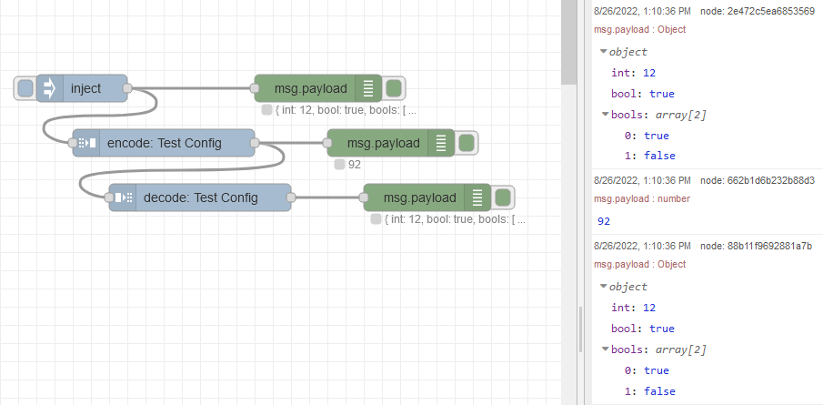
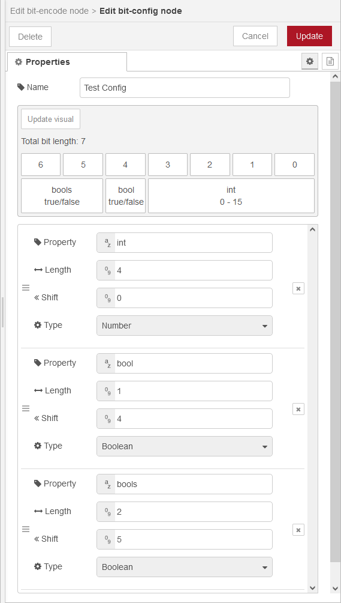

# node-red-bit-encode

A set of Node-RED nodes for encoding multiple positive integer or boolean values into a single positive integer, and unpacking to receive the original object.

## How to use



The encode and decode nodes use a shared configuration node so all configuration is done in a single place.

The provided example flow uses the following configuration:



With this configuration, the input message to the encode node should look something like this:

```js
msg.payload = {
  int: 12,             // 4 bit integer, 0-15
  bool: true,          // boolean value because `length` == 1
  bools: [true, false] // boolean array because `length` > 1
}
```

After passing through the encode node, it would output a `msg.payload` of a single integer value of `92`.

After passing the encoded value of `92` through the decode node, it would output the original `msg.payload` object:

```js
msg.payload = {
  int: 12,
  bool: true,
  bools: [true, false]
}
```
